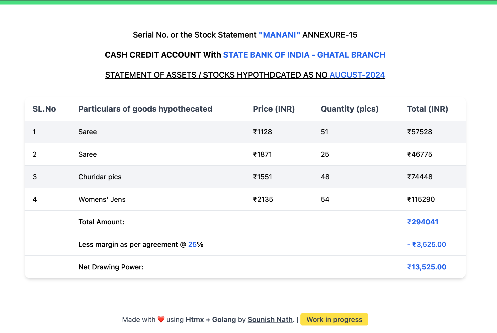

# Sales Report Generator Project

This project aims to create a web application that generates sales reports based on user input. The application is built using Go and utilizes the Echo framework for handling HTTP requests and responses. The project includes two main pages: an index page and a sales report generator page.

## Current Progress

- The project structure has been set up with the necessary Go modules and dependencies.
- The index page has been created with a simple layout and a button to navigate to the sales report generator page.
- The sales report generator page has been created with a basic layout and placeholder text.
- The project includes a template engine to dynamically render data on the pages.
- A database has been integrated to store sales data and user information.
- A form has been developed on the sales report generator page to collect user input for generating reports.
- Logic has been implemented to generate sales reports based on user input and display the report on the page.

## Screenshots

- Homepage UI:
  
- Sales Report Generator UI:
  

## Future Development

- Add more features to the report generator, such as filtering and sorting options.
- Implement PDF generation for reports.
- Test and deploy the application.
- Enhance user experience with additional visualizations and interactive elements.

## How to run

- Install dependencies

  ```bash
  make install-deps
  ```

- Run locally
  ```bash
  make run
  ```

## Contributing

Contributions are welcome! If you'd like to contribute to this project, please fork the repository, make your changes, and submit a pull request.

## Inspired by

- [@github/moroz/Pdf-Generator-Video](https://github.com/moroz/pdf-generation-video/) : Which uses the LateX to generate the PDF files.
- [Learn Blog creation with Htmx and Go](https://medium.com/gravel-engineering/this-blogpost-also-posted-in-my-personal-blog-which-you-can-access-here-dd856c61001)
- [Google Chome Headless Features](https://developer.chrome.com/docs/chromium/new-headless)

## Benefits

- Learn go webservices and htmx templating
- Easy to manage and configure the business reports
- Monthwise report automatic generation and PDF profilings
